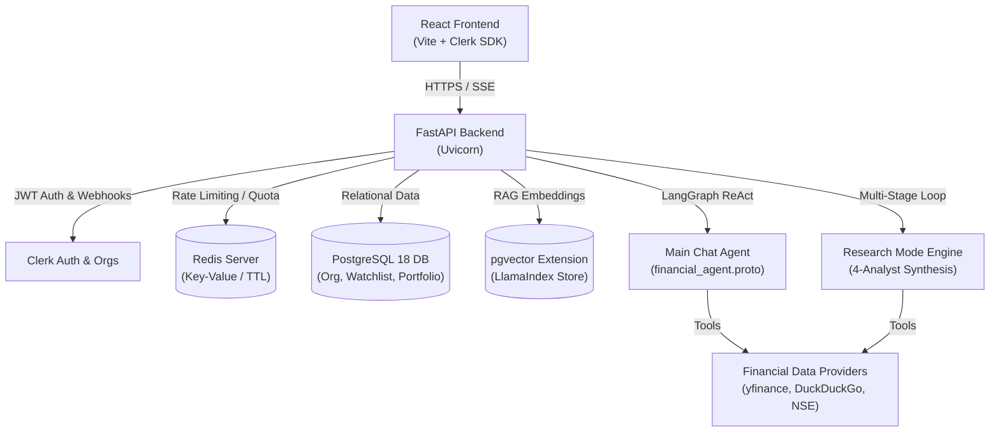

# Finance-Harness Architecture & System Topology

This document describes the high-level architecture, component interaction, and deployment topology of `finance-harness`.

---

## 1. System Overview & Diagram

`finance-harness` is an AI-powered financial agent platform built with FastAPI (backend) and React/Vite (frontend). Authentication and multi-tenancy are powered by Clerk Organizations (RBAC: Admin vs Analyst). Rate-limiting and quota tracking are backed by Redis, while agent operations run on LangGraph (chat ReAct loop) and an iterative multi-stage research engine. Vector embeddings for RAG are stored using LlamaIndex with PostgreSQL pgvector.

---

## 2. Component Hierarchy & Flow Narrative

### A. Authentication & Multi-Tenancy
- **Clerk Integration**: Authentication uses Clerk JWTs (`AuthContext`). Users belong to Organizations (`Organization` mirror table).
- **RBAC**: 
  - `org:admin`: Full CRUD permissions on portfolios, watchlists, research reports, and organization management.
  - `org:member` (Analyst): Read-only view + unconditional chat access. Mutating actions return 403.

### B. Agent Streaming Engine
- **Main Chat (`graph.py`)**: Uses LangGraph's prebuilt ReAct agent (`create_react_agent`). Streams events over Server-Sent Events (SSE) serialized in Base64-encoded Protobuf (`financial_agent.proto`).
- **Research Mode (`research_graph.py`)**: Executes an iterative data-gathering loop (Planner LLM -> `asyncio.gather` tool fan-out -> Memory fan-in -> 10 RPM pacing delay) followed by a synthesis LLM report stream.

### C. Quota & Rate Limiting
- Daily user quotas are tracked in Redis using keys structured as `quota:{clerk_user_id}:{utc_date}:{tier}` with auto-expiring TTLs set to UTC midnight.

### D. RAG Pipeline
- Organizations can ingest research reports and web URLs into LlamaIndex chunks stored in PostgreSQL via `pgvector`.
- The `search_org_research_reports` tool retrieves relevant past organizational reports to answer queries.

---

## 3. Deployment Topology

- **Production Environment**: Deployed natively on Amazon Linux 2023 EC2 (`ec2-hobby`).
  - **Reverse Proxy**: Nginx handling SSL/TLS termination and proxying to the Docker container.
  - **Application**: Docker container (`finance-agent-app`) bound to internal ports.
  - **Database**: Native PostgreSQL 18 with `vector` extension running on localhost.
  - **Cache**: Native Redis 6/7 bound to localhost.
