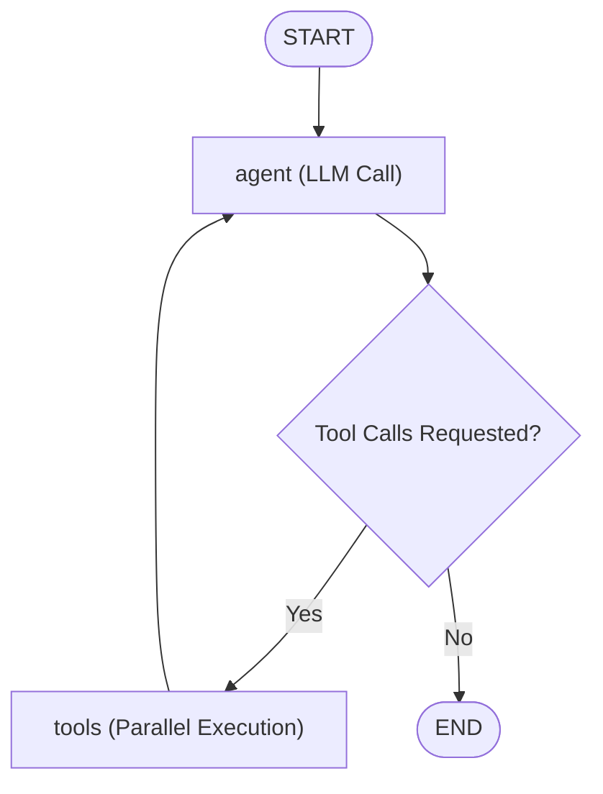
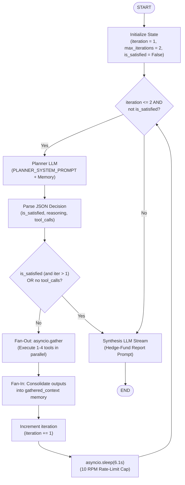

# Agent Execution Architecture & State Graphs

This document details the execution flow and architecture of the main chat agent and research mode agent in `finance-harness`.

---

## 1. Main Chat Agent (`backend/app/agent/graph.py`)

The main chat agent is built using LangGraph's prebuilt `create_react_agent`. It runs a ReAct (Reason + Act) loop streamed via `astream_events`.

### Mermaid Diagram

---

## 2. Research Mode (`backend/app/agent/research_graph.py`)

Research mode is **not** a LangGraph `StateGraph`. It is implemented as an imperative `while` loop that handles iterative planning, parallel tool execution, memory consolidation, rate-limit pacing, and final synthesis streaming.

### Mermaid Diagram

